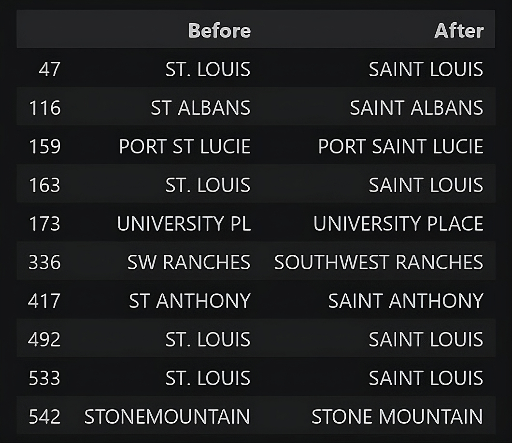
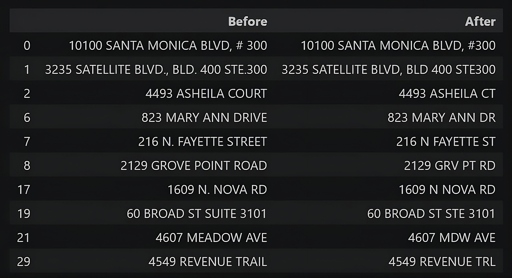
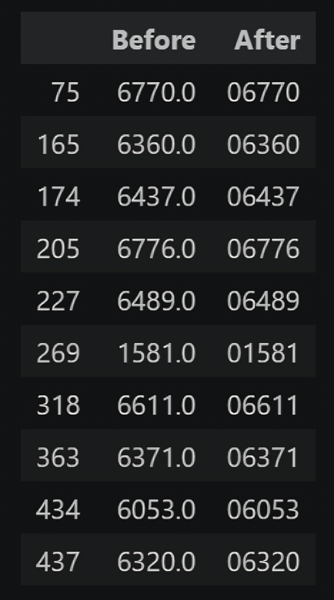
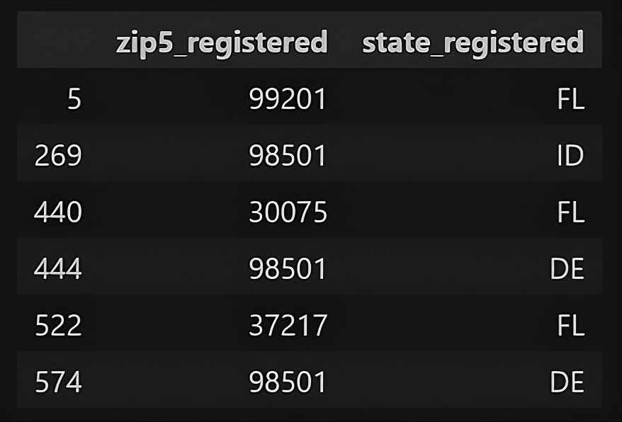
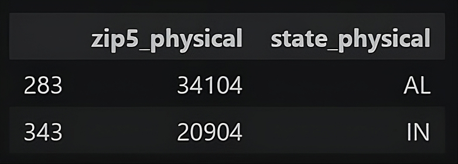

# Data Cleaning of U.S. Business Dataset


A portfolio project demonstrating a structured and reproducible data-cleaning workflow using **Python** and **Pandas** on a sample of U.S. business records.

The project separates reusable cleaning and validation logic into a Python package while documenting the complete workflow in a Jupyter Notebook.

## Project Structure

```text
project/
├── assets/
│   └── screenshots/
│       ├── cleaning_cities.png
│       ├── cleaning_addresses.png
│       ├── cleaning_zip_codes.png
│       ├── validation_registered_zip.png
│       └── validation_physical_zip.png
├── data/
│   ├── raw/
│   │   └── us_businesses_data.csv
│   ├── processed/
│   │   └── cleaned_us_businesses.csv
│   └── external/
│       └── zip_codes_database.csv
├── notebooks/
│   └── 01_data_cleaning.ipynb
├── src/
│   └── data_cleaner/
│       ├── __init__.py
│       ├── constants.py
│       └── functions.py
├── requirements.txt
└── README.md
```

> The external ZIP-code reference dataset is not included in the repository because its license does not permit redistribution without the appropriate license.

## Features

* Handling missing and uninformative columns
* Business name normalization
* Business type normalization
* U.S. state abbreviation validation
* City name normalization
* Street address formatting
* ZIP-code cleaning and standardization
* ZIP/state consistency validation
* Exporting the cleaned dataset as a CSV file

## Cleaning Results

The cleaning process standardized business names, business types, state abbreviations, cities, street addresses, and ZIP codes.

<table align="center">
  <caption style="caption-side: top; font-size: 24px; font-weight: bold; margin-bottom: 10px;">Cleaning Before and After</caption>
  <tr>
    <td align="center"><b>Cities</b></td>
    <td align="center"><b>Addresses</b></td>
    <td align="center"><b>ZIP Codes</b></td>
  </tr>
  <tr>
    <td></td>
    <td></td>
    <td></td>
  </tr>
</table>

## Validation

ZIP codes and state abbreviations are checked for geographic consistency using an external ZIP-code reference dataset.

Because the reference dataset may not contain every valid U.S. ZIP code, the validation uses ZIP-code prefixes rather than exact ZIP-code matching.

<table align="center">
  <caption style="caption-side: top; font-size: 24px; font-weight: bold; margin-bottom: 10px;">Validation Examples: Invalid ZIP/State Matches</caption>
  <tr>
    <td align="center"><b>ZIP Registered</b></td>
    <td align="center"><b>ZIP Physical</b></td>
  </tr>
  <tr>
    <td></td>
    <td></td>
  </tr>
</table>

The validation results are stored in the following columns:

* `registered_zip_state_validation`
* `physical_zip_state_validation`

Records are classified as valid, invalid, or missing based on the available ZIP and state information.

## Installation

Clone the repository and install the required dependencies:

```bash
pip install -r requirements.txt
```

### Requirements

* Python 3.14
* pandas 3.0.5
* numpy 2.5.1

## Required Datasets

### Raw Business Dataset

The project uses a sample of the **DoltHub U.S. Businesses** dataset.

Place the dataset at:

```text
data/raw/us_businesses_data.csv
```

Source: [DoltHub – U.S. Businesses](https://www.dolthub.com/repositories/dolthub/us-businesses)

### External Validation Dataset

ZIP/state validation requires a ZIP-code reference dataset from **ZIP-Codes.com**.

Place the file at:

```text
data/external/zip_codes_database.csv
```

This dataset is used only for validation and is **not included in the repository** because its license does not permit redistribution of the raw database without the appropriate redistribution license.

Source: [ZIP-Codes.com](https://www.zip-codes.com/)

## Running the Project

1. Clone the repository.
2. Install the required dependencies.
3. Place the raw business dataset in `data/raw/`.
4. Place the ZIP-code reference dataset in `data/external/`.
5. Open `notebooks/01_data_cleaning.ipynb`.
6. Run the notebook cells in order.

The cleaned dataset will be exported to:

```text
data/processed/cleaned_us_businesses.csv
```

## Design Decisions

### Conservative Cleaning

The cleaning process avoids making unsupported assumptions about ambiguous values.

Values that could not be reliably corrected were either preserved or converted to missing values rather than being forcefully modified.

### ZIP Codes as Strings

ZIP codes are identifiers rather than numerical quantities. Therefore, they are stored as strings to preserve leading zeros.

For example:

```text
01581
```

should not be interpreted as the number `1581`.

### Separate Cleaning and Validation Logic

Reusable cleaning and validation functions are stored in the `src/data_cleaner` package, while the Jupyter Notebook documents the workflow and presents the results.

This separation makes the code easier to reuse and maintain.

## Data Sources

1. **DoltHub – U.S. Businesses**
   Used as the primary dataset for the cleaning workflow.

2. **ZIP-Codes.com – ZIP Code Database**
   Used as an external reference for ZIP/state consistency validation.
