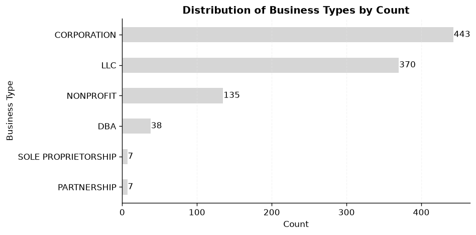
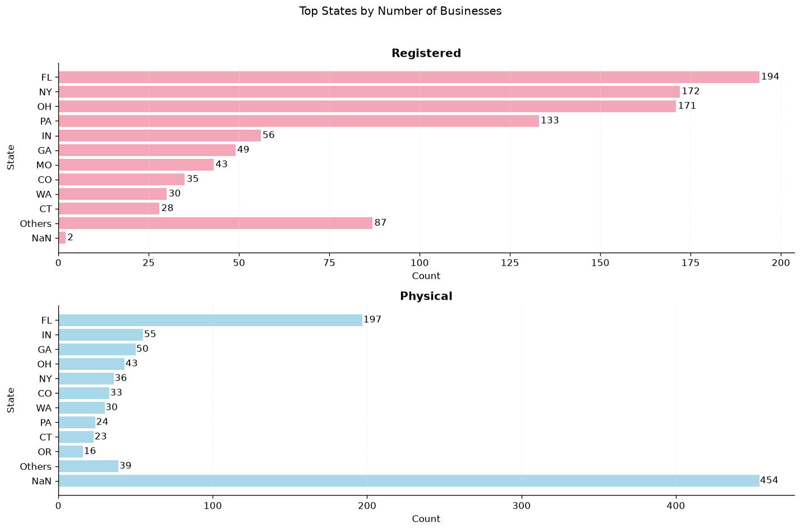
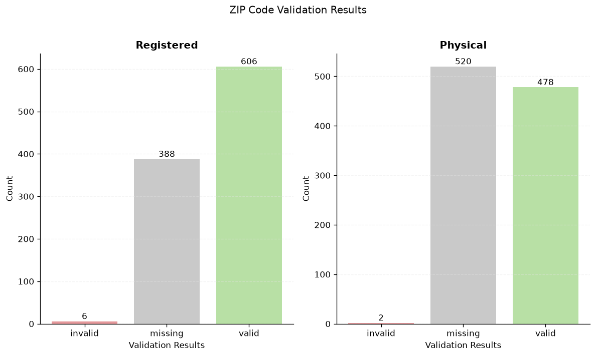

# Data Cleaning & EDA of U.S. Business Dataset


A portfolio project demonstrating a structured and reproducible data-cleaning workflow and exploratory data analysis (EDA) on a sample of U.S. business records. The project uses **Python** and **Pandas** to clean, validate, and analyze the dataset.

The cleaning and validation logic is separated into a reusable Python package while the complete workflow is documented in Jupyter Notebooks.

## Project Structure

```text
project/
├── assets/
│   ├── plots/
│   │   ├── business_type_distribution.png
│   │   ├── top_states_registered_vs_physical.png
│   │   └── zip_validation_results.png
│   └── screenshots/
│       ├── cleaning_cities.png
│       ├── cleaning_addresses.png
│       └── cleaning_zip_codes.png
├── data/
│   ├── raw/
│   │   └── us_businesses_data.csv
│   ├── processed/
│   │   └── cleaned_us_businesses.csv
│   └── external/
│       └── zip_codes_database.csv
├── notebooks/
│   ├── 01_data_cleaning.ipynb
│   └── 02_eda.ipynb
├── src/
│   └── data_cleaner/
│       ├── __init__.py
│       ├── constants.py
│       └── functions.py
├── requirements.txt
└── README.md
```

> The external ZIP-code reference dataset is not included in the repository because its license does not permit redistribution without the appropriate license.

## Features

The project is divided into two main phases: data cleaning and exploratory data analysis.

### 1. Data Cleaning

- **Column Handling:** Removal of high-missingness, uninformative columns (`ein`, `sic4`, `duns`, `parent`, `website`, `naics_2017`).

- **Business Names:** Normalization of names and standardization of legal entity types (e.g., `INCORPORATED` -> `INC`, `L.L.C.` -> `LLC`).

- **Business Types:** Normalization to a predefined set of valid categories.

- **Geographic Data:**
  - Cleaning and validation of U.S. state postal abbreviations.
  - Normalization of city names, including typo correction and abbreviation expansion (e.g., `ST. LOUIS` -> `SAINT LOUIS`).
  - Standardization of street addresses, including street suffixes and secondary-unit designators.

- **ZIP Codes:** Cleaning as string identifiers, preserving leading zeros (e.g., `01581`).

- **Validation:** Cross-validation of ZIP codes against states using a prefix-based method with an external reference dataset.

- **Export:** Saving the final, cleaned dataset to `data/processed/`.

### 2. Exploratory Data Analysis (EDA)

- **Business Type Distribution:** Analyzing the frequency of different business types.

- **Geographic Concentration:**
  - Identifying top states and cities by the number of businesses (for both registered and physical addresses).
  - Comparing the geographic distribution of registered vs. physical locations.

- **Business Type by State:** Visualizing the composition of business types across different states.

- **Validation Results:** Summarizing the outcomes of the ZIP/state consistency checks.

- **Missing Values Analysis:** Comparing the number of missing values before and after the cleaning process.

## Cleaning Results

The cleaning process standardized business names, business types, state abbreviations, cities, street addresses, and ZIP codes.

<table align="center" style="margin: 20px auto;">
  <caption style="caption-side: top; font-size: 22px; font-weight: bold; padding-bottom: 10px;">
    Cleaning Before and After
  </caption>
  <tr>
    <td align="center" valign="top"><b>Cities</b></td>
    <td align="center" valign="top"><b>Addresses</b></td>
    <td align="center" valign="top"><b>ZIP Codes</b></td>
  </tr>
  <tr>
    <td align="center" valign="top">
      
    </td>
    <td align="center" valign="top">
      
    </td>
    <td align="center" valign="top">
      
    </td>
  </tr>
</table>

## Key Findings

Based on the cleaned 1,000-record sample, several notable patterns emerged during exploratory analysis.

### 1. Business Type Distribution is Highly Concentrated

Corporations (~44%) and LLCs (~37%) dominate the dataset, together accounting for over 80% of all records. Nonprofits, DBAs, Partnerships, and Sole Proprietorships appear much less frequently in this sample.

<p align="center">
  
</p>

### 2. Business Records are Concentrated in a Few States

Florida (FL), New York (NY), and Ohio (OH) account for over half of all registered business records in the sample. Florida is the top state for both registered and physical addresses, but beyond that the rankings diverge notably (e.g., NY and PA rank highly among registered addresses but fall far lower among physical addresses), and physical-state data is missing for nearly half the records, which limits how far this comparison can be pushed.

<p align="center">
  
</p>

### 3. Location Fields Contained Substantial Missing Data

Initial inspection showed substantial missingness in location fields: physical ZIP codes were missing in more than half of records (~52%), while physical states (~45%) and registered ZIP codes (~39%) were also missing at high rates. Existing values were standardized where possible, while incomplete records were preserved and flagged for downstream analysis.

### 4. ZIP/State Validation Identified Data Inconsistencies

Cross-checking ZIP codes against an external ZIP database found six invalid registered ZIP/state combinations and two invalid physical ZIP/state combinations. Rather than automatically correcting these records, they were flagged in dedicated validation columns for future review.

<p align="center">
  
</p>

## Validation

ZIP codes and state abbreviations are checked for geographic consistency using an external ZIP-code reference dataset.

Because the reference dataset may not contain every valid U.S. ZIP code, the validation uses **ZIP-code prefixes** rather than exact ZIP-code matching. The prefix (the first two digits) is used to determine whether a ZIP code is geographically consistent with its corresponding state.

The validation results are stored in the following columns:

- `registered_zip_state_validation`
- `physical_zip_state_validation`

Records are classified as one of three categories:

- `valid` — The ZIP prefix matches the state in the reference dataset.
- `invalid` — The ZIP prefix does not match the state.
- `missing` — The ZIP code or state value is unavailable.

## Installation

Clone the repository:

```bash
git clone https://github.com/MahyaDev/us-businesses-data-cleaning.git
```

Install the required dependencies:

```bash
pip install -r requirements.txt
```

### Requirements

* Python 3.14+
* pandas 3.0.5+
* numpy 2.5.1+
* matplotlib 3.11.1+

## Required Datasets

### Raw Business Dataset

The project uses a sample of the **DoltHub U.S. Businesses** dataset.

Place the dataset at:

```text
data/raw/us_businesses_data.csv
```

Source: [DoltHub – U.S. Businesses](https://www.dolthub.com/repositories/dolthub/us-businesses)

### External Validation Dataset

ZIP/state validation requires a ZIP-code reference dataset from **ZIP-Codes.com**.

Place the file at:

```text
data/external/zip_codes_database.csv
```

This dataset is used only for validation and is **not included in the repository** because its license does not permit redistribution of the raw database without the appropriate redistribution license.

Source: [ZIP-Codes.com](https://www.zip-codes.com/)

## Running the Project

1. Follow the installation steps above.

2. Ensure both the raw business dataset and the external ZIP-code dataset are in their correct directories.

3. Open and run the notebooks in order:

   - `notebooks/01_data_cleaning.ipynb`
   - `notebooks/02_eda.ipynb`

4. The cleaned dataset will be exported to `data/processed/cleaned_us_businesses.csv`.

## Design Decisions

- **Conservative Cleaning:** Ambiguous values were preserved or converted to `NaN` instead of being forcefully corrected.

- **ZIP Codes as Strings:** ZIP codes are identifiers rather than numerical values, so they are stored as strings to preserve leading zeros.

- **Prefix-Based Validation:** The first two digits of each ZIP code are used to validate geographic consistency because the reference dataset may not be exhaustive.

- **Separation of Cleaning and EDA:** The cleaning notebook exports a dedicated processed dataset that is loaded independently by the EDA notebook, creating a clear separation between preprocessing and analysis.

## Data Sources

1. **DoltHub – U.S. Businesses**
   Used as the primary dataset for the cleaning workflow.

2. **ZIP-Codes.com – ZIP Code Database**
   Used as an external reference for ZIP/state consistency validation.